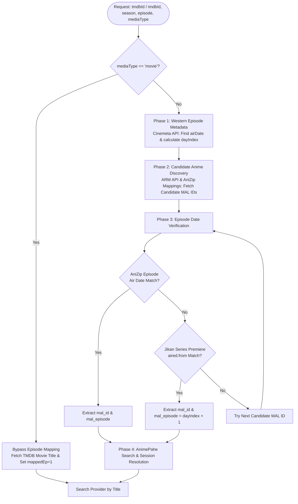

# Anime Synchronization & ID Mapping Guide (ID Mapping Engine v1.5.0)

This document describes the architecture, air-date comparison logic, API specifications, and client-side resolution pipeline used to map Western anime metadata (Cinemeta / IMDb / TMDB) to Japanese anime tracking entries (MyAnimeList / AniList / AniZip) for precise scraping across providers such as AnimePahe.

---

## 1. Problem Statement

Western metadata providers (TMDB, IMDb, Cinemeta, TVDb) and Japanese anime tracking databases (MyAnimeList, AniList, AniDB) organize anime releases according to fundamentally conflicting models:
- **Western Structure**: Anime is aggregated into traditional western TV seasons (e.g. Attack on Titan Season 4 Episodes 1–30; Jujutsu Kaisen Season 2 Episodes 1–23).
- **Japanese Structure**: Each cour, split-season, OVA, TV special, or movie is listed as an independent database entry with its own ID (e.g. Attack on Titan: The Final Season Part 1, Part 2, The Final Chapters Special 1, Special 2).

Direct numerical mapping (e.g. requesting "Season 4, Episode 29") fails because Japanese trackers do not recognize Western season numbers, and title matching alone fails due to differences between English, Romaji, and Kanji titles.

---

## 2. Core Philosophy: The Absolute Air-Date Rule

> [!IMPORTANT]
> **Only compare dates, never numbers.**
> The only immutable link between a Western episode and a Japanese anime episode entry is the **UTC broadcast air date**.

Because television broadcasts air across international time zones (JST vs. UTC vs. EST), air dates can differ by up to 24–48 hours depending on when metadata scrapers index the episode.

### Date Matching Algorithm (`isDateMatch`)
A tolerance of $\le 2$ days is applied when comparing air date strings:

```javascript
function isDateMatch(d1, d2) {
    if (!d1 || !d2) return false;
    const s1 = d1.split('T')[0];
    const s2 = d2.split('T')[0];
    const date1 = new Date(s1 + "T00:00:00Z");
    const date2 = new Date(s2 + "T00:00:00Z");
    const diff = Math.abs(date1.getTime() - date2.getTime());
    return Math.ceil(diff / (1000 * 60 * 60 * 24)) <= 2;
}
```

### Day Indexing (`dayIndex`)
When multiple episodes air on the same calendar day (such as double-episode premieres or batch drops), the scraper calculates the zero-based order of earlier episodes airing on that identical date:

$$\text{dayIndex} = \operatorname{count}\Big(v \in \text{videos} \;\Big|\; v.\text{released} = \text{targetDate} \land (v.s < s \lor (v.s = s \land v.e < e))\Big)$$

The resolved candidate is selected at index `dateMatches[dayIndex]`.

---

## 3. Resolution Workflow Architecture



---

## 4. Resolution Stages

### Phase 1: Western Metadata Acquisition
1. Retrieve `imdb_id` via TMDB external IDs or ARM fallback (`https://api.themoviedb.org/3/tv/{id}/external_ids`).
2. Query Cinemeta series metadata across mirrors:
   - Primary: `https://v3-cinemeta.strem.io/meta/series/{imdbId}.json`
   - Mirrors: `https://cinemeta-live.strem.io/meta/series/{imdbId}.json`, `https://v3-meta.stremio.com/meta/series/{imdbId}.json`
3. Locate the video entry matching `season` and `episode`.
4. Extract `airDate` (`released.split('T')[0]`) and calculate `dayIndex`.

### Phase 2: Candidate MAL ID Discovery
Query candidate anime relations from the Anime Relations Map (ARM) and AniZip:
- ARM IMDb endpoint: `https://arm.haglund.dev/api/v2/imdb?id={imdbId}`
- ARM TMDb endpoint: `https://arm.haglund.dev/api/v2/themoviedb?id={tmdbId}`
- ARM TVDb endpoint: `https://arm.haglund.dev/api/v2/thetvdb?id={tvdbId}`
- AniZip mapping endpoint: `https://api.ani.zip/mappings?themoviedb_id={tmdbId}` or `?imdb_id={imdbId}`

Collect unique candidate `myanimelist` IDs and sort descending (`(a, b) => b - a`) so newer entries/specials are evaluated first.

### Phase 3: Episode Date Verification
For each candidate `malId`:
1. **AniZip Episode Verification**:
   Query `https://api.ani.zip/mappings?mal_id={malId}`.
   Compare `airDateUtc` / `airDate` against target `airDate` using `isDateMatch()`.
   If a match exists at `dateMatches[dayIndex]`, return:
   ```json
   {
     "mal_id": 51535,
     "mal_episode": 1,
     "anime_title": "Attack on Titan",
     "air_date": "2023-03-03"
   }
   ```
2. **Jikan / Premiere Date Fallback**:
   If individual episode records are missing (e.g. special batch releases), check series start date `aired.from` via Jikan (`https://api.jikan.moe/v4/anime/{malId}`). If `isDateMatch(aired.from, airDate)` matches, assign `mal_episode = dayIndex + 1`.

---

## 5. Movie Exception Rule

> [!NOTE]
> Movies do not possess seasonal episode splits. When `mediaType === 'movie'`, the scraper **bypasses episode resolution entirely**.
- The scraper queries TMDB movie details directly for `title` and `original_title`.
- Target episode is set to `mappedEp = 1`.
- The provider queries the movie title directly on AnimePahe releases.
